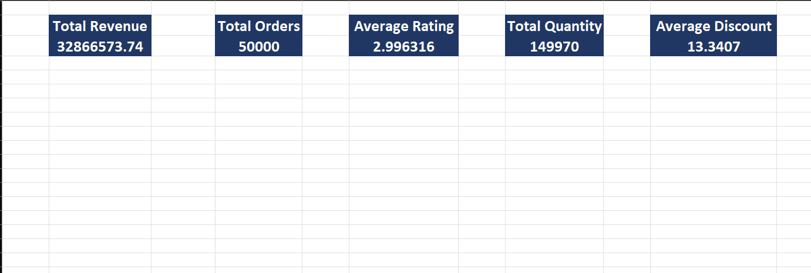

# Amazon Sales Dashboard (Excel)

## Project Overview

This project analyzes Amazon sales data using Microsoft Excel.

The dashboard provides insights into sales performance, customer behavior, and product trends using interactive visualizations.

---

## Dashboard Preview

---

## KPIs

- Total Revenue
- Total Orders
- Average Rating
- Total Quantity Sold
- Average Discount

---

## Visualizations

- Revenue by Product Category
- Revenue by Region
- Monthly Revenue Trend
- Orders by Payment Method
- Quantity Sold by Category
- Average Rating by Category

---

## Tools Used

- Microsoft Excel
- Pivot Tables
- Pivot Charts
- KPI Cards
- Data Visualization

---

## Dataset

Amazon Sales Dataset (50,000 records)

---

## Skills Demonstrated

- Data Cleaning
- Data Analysis
- Dashboard Design
- Excel Functions
- Business Intelligence
